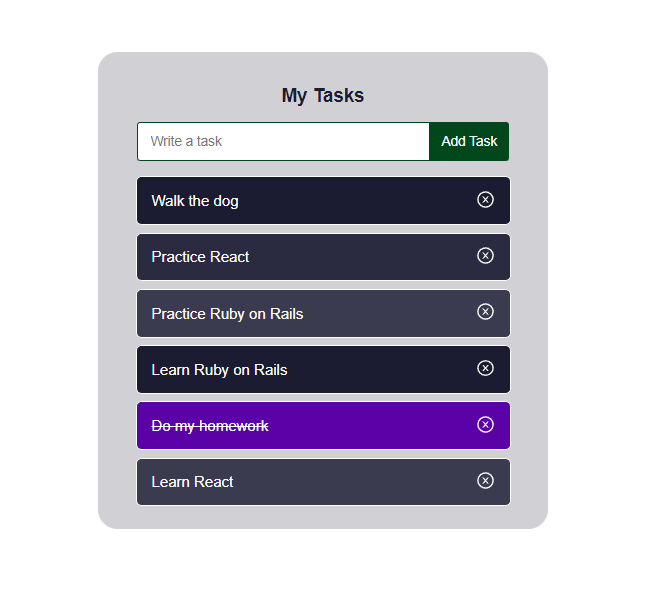

# React Tasks App

> Another React exercise to store tasks.

## Built With

- React 18.1.0
- JSX
- CSS

## Getting Started

**To run this project locally follow the next simple steps**

### Prerequisites

- NodeJS

### Setup

- Get a copy of the project `git clone https://github.com/me-skit/react-tasks.git`.
- Inside the project folder run, `npm install` in order to get the dependencies.
- Start a local server using the `npm start`.
- Use the `http://localhost:3000` in a web browser to check it out.

## Author

👤 **Meme**

- Github: [@me-skit](https://github.com/me-skit)
- Linkedin: [linkedin](https://www.linkedin.com/in/manuel-elias/)

## 🤝 Contributing

Contributions, issues and feature requests are welcome!

Feel free to check the [issues page](https://github.com/me-skit/react-tasks/issues).

## Show your support

Give a ⭐️ if you like this project!

## 📝 License

This project is not licensed.
